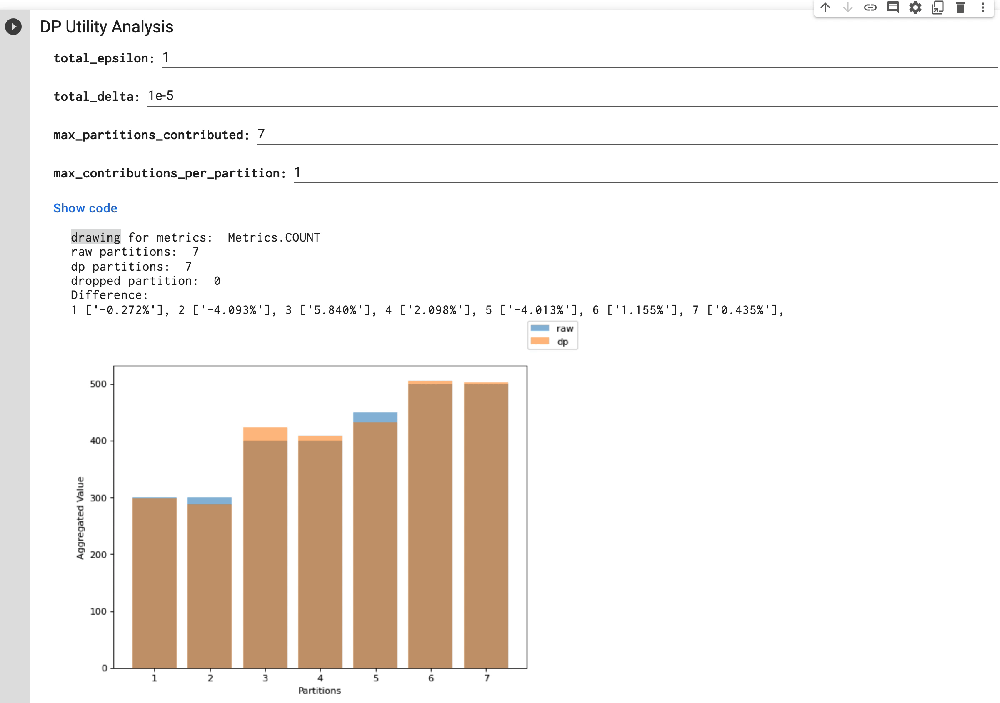

# Utility Analysis for PipelineDP

To make differential privacy easy to use for all the users in a scalable way. Utility Analysis library provides convenient ways for PipelineDP users to tune DP utility parameters and provide tools to conduct privacy utility analysis.

## Why utility analysis

When applying differential privacy, the quality of your data might deteriorate due to many factors. And multiple parameters can influence the data deterioration.

The utility analysis tool has designed a tool that performs a process that simulates the behavior of DP on a sample of your data and shows how different parameter settings affect the quality of your aggregation metrics. This exploration might help you have a data-driven decision on usages of DP.

## Getting started

To get started on using the library, we recommend you follow the codelab at
this [ipython notebook](examples/Utility_Analysis_for_PipelineDP.ipynb).

Code sample showing sketching

```python
# input_data = ...
dp_metric = pipeline_dp.Metrics.COUNT
# Tells the method how to extract the privacy ID,
# the partition key and the value to be aggregated
# from the input data
data_extractors = pipeline_dp.DataExtractors(
    partition_extractor=lambda row: row.day,
    privacy_id_extractor=lambda row: row.user_id,
    value_extractor=lambda row: row.spent_money)
# Set sampling amount
MAX_PARTITION_NUM = 100
# Set a proper pipeline backend.
# pipeline_backend =
peeker = utility_analysis.DataPeeker(pipeline_backend)
sample_params = utility_analysis.SampleParams(
    number_of_sampled_partitions=MAX_PARTITION_NUM, metrics=[dp_metric])
sketches = list(peeker.sketch(input_data, sample_params,
                                  data_extractors))
```

Code sample showing tuning on sketches

```python
# Specify local backend because utility anlysis is supposed to be run locally in an interactive environment
pipeline_backend = pipeline_dp.LocalBackend()
budget_accountant = pipeline_dp.NaiveBudgetAccountant(total_epsilon=total_epsilon, total_delta=total_delta)
# Creates peeker engine to aggregate sketches.
peeker_engine = utility_analysis.peeker_engine.PeekerEngine(budget_accountant, pipeline_backend)
# Set PipelineDP parameters
# params = ...
# Compute approximated DP metrics on sketches in real time
dp_result = peeker_engine.aggregate_sketches(sketches, params)
budget_accountant.compute_budgets()
dp_result = list(dp_result)
```

## Development and Support

Please refer to the development guide of PipelineDP.

Please note that the project is in an early development stage, more detailed descriptions and examples will be added over time.
